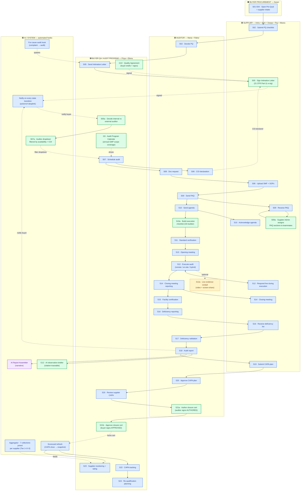

# Hawkeye Audit Flow — Swim-Lane Diagram

*Persona-lane process map for the canonical 26-step audit lifecycle (the 24-step expert flow + 2 reconciled additions for remote-audit reality). Shipped state as of 2026-04-29 — all P0/P1 gaps closed except G7 (remote-audit video cockpit, deferred).*

---

## §1 — How to read

**Five lanes**, each owned by a persona group. Boxes flow top-to-bottom within a lane; **arrows that cross lanes are persona handoffs**. Color encoding tells you what just shipped vs. what was already there:

| Color | Meaning |
|---|---|
| 🟢 green | **Just shipped** as part of the gap-closing roadmap (commit 589d8ac + 569c438) |
| 🔵 blue | Already wired before the gap sprint |
| 🟣 purple | AI / System automation — runs without a human click |
| 🟡 yellow | Deferred to a later phase (G7 — remote-audit cockpit) |

**Lanes:**

| Lane | Color | Owner | Personas | Their job |
|---|---|---|---|---|
| 🟧 BUYER PROCUREMENT | yellow | Karan | Karan Mehta | Initiates supplier engagements (PQ creation) |
| 🟦 BUYER QA / AUDIT PROGRAM | blue | Priya · Elena | Priya Nair (Audit PM) · Dr Elena Vasquez (VP QA) | Owns the audit programme, assigns auditors, approves CAPA, signs closure |
| 🟪 AUDITOR | purple | Maria · Rahul | Maria Santos (Lead) · Rahul Kapoor (Co) | 3rd-party or internal — runs the audit + drafts report + generates CAPAs |
| 🟩 SUPPLIER | green | Asha + team | Asha Sharma (QA Head) · Amit · Deepa · Raj · Meera | Signs intimation, fills PAQ, assigns sections, submits CAPA |
| 🟥 AI / SYSTEM | red | (automated) | — | Closure-loop hooks, scorecard refresh, observation drafter |

---

## §2 — Swim-lane (full 26 steps)

---

## §3 — The two key handoff patterns

**1. Linear audit lifecycle (solid arrows):**

`Karan (S01)` → `Supplier (S02)` → `Auditor (S02 decision)` → `Buyer QA (S05 send intimation, S05a pick auditor type)` → **`Supplier (S05 sign)`** → `Auditor (S06 COI · S08-S11 prep)` → **`Auditor (S10a build execution checklist)`** → `Auditor (S12 execute, S13-S15)` → `Supplier (S19 CAPA)` → `Auditor (S20 approve · S21a sign closure)` → **`Buyer QA (S21b approve closure)`** → System (scorecard refresh)

The bold steps are the four shipped-this-sprint additions that fill what was broken in the demo.

**2. EQMS↔Supplier bridge automation (dotted arrows from System lane):**

- Every quality event (deviation, complaint) feeds the unified Quality Events pane
- For-cause audit hook spawns a new audit when a critical complaint is filed
- CAPA closure auto-refreshes the supplier scorecard
- Audit Program Calendar drives buyer QA scheduling
- Quality Agreement constrains intimation letter content (audit-rights clause must hold)

---

## §4 — What's shipped vs. deferred

| Layer | Shipped | Deferred |
|---|---|---|
| **Backend** | G1 intimation sign · G2 available-auditors filter · G3 auditor affiliation · G4 bulk PAQ assignment · G5 execution scope · G8 closure cert · G9 audit program · G10 quality agreement · G11 formality resolver · G12 observation drafter (skeleton) | G7 video cockpit |
| **Frontend** | G1 sign button · G2 selector prop · G4 bulk-assign page · G5 execution builder · G8 closure cert page | G7 cockpit · G9/G10 management UIs · G12 drafter UI |
| **E2E tests** | 42/42 PASS covering G1, G2, G3, G5, G8, G9, G10, G12 | G4 (needs supplier-team mock) · G7 |

---

## §5 — Process flow as a numbered list (for accessibility)

| # | Step | Lane | Who | Status |
|---|---|---|---|---|
| 1 | Open Pre-Qualification | Buyer Procurement | Karan | 🔵 |
| 2 | Submit PQ checklist | Supplier | Asha | 🔵 |
| 3 | Decide PQ (approve/conditional/reject) | Auditor | Maria | 🔵 |
| 4 | Approved PQ → ready to audit | System | — | 🔵 |
| 5 | Send Intimation Letter | Buyer QA | Priya | 🔵 |
| 6 | **Sign Intimation Letter (e-sig)** | Supplier | Asha | 🟢 G1 |
| 7 | **Decide internal vs external auditor** | Buyer QA | Priya | 🟢 G3/G5a |
| 8 | **Auditor dropdown filtered by availability + COI** | System | — | 🟢 G2/S07a |
| 9 | Schedule audit | Buyer QA | Priya | 🔵 |
| 10 | COI declaration | Auditor | Maria | 🔵 |
| 11 | Pre-audit doc request | Auditor | Maria | 🔵 |
| 12 | Upload SMF + SOPs | Supplier | Asha | 🔵 |
| 13 | Send PAQ | Auditor | Maria | 🔵 |
| 14 | **Supplier admin bulk-assigns PAQ sections** | Supplier | Asha | 🟢 G4 |
| 15 | Each teammate fills assigned section | Supplier | Amit · Deepa · Raj · Meera | 🔵 |
| 16 | Send agenda | Auditor | Maria | 🔵 |
| 17 | Acknowledge agenda | Supplier | Asha | 🔵 |
| 18 | **Build execution checklist (curate from template)** | Auditor | Maria | 🟢 G5 |
| 19 | Standard verification | Auditor | Maria | 🔵 |
| 20 | Opening meeting | Auditor + Buyer + Supplier | Maria + Priya + Asha | 🔵 |
| 21 | Execute audit (remote/on-site/hybrid) | Auditor + Supplier | Maria + Asha | 🔵 |
| 22 | **Live evidence capture cockpit** | Auditor + Supplier | (deferred) | 🟡 G7 |
| 23 | Closing meeting | Auditor + Supplier | Maria + Asha | 🔵 |
| 24 | Facility certification | Auditor + Buyer QA | Maria + Priya | 🔵 |
| 25 | Deficiency reporting | Auditor → Supplier | Maria → Asha | 🔵 |
| 26 | Deficiency validation | Auditor + Supplier | Maria + Asha | 🔵 |
| 27 | Audit report | Auditor | Maria | 🔵 |
| 28 | **AI observation drafter (citation-traceable)** | System | — | 🟢 G12 |
| 29 | Per-finding CAPA generated | Auditor | Maria | 🔵 |
| 30 | Submit CAPA plan | Supplier | Asha | 🔵 |
| 31 | Auditor reviews CAPA | Auditor | Maria | 🔵 |
| 32 | Buyer reviews CAPA | Buyer QA | Priya | 🔵 |
| 33 | **Auditor authors closure certificate (AUTHORED sig)** | Auditor | Maria | 🟢 G8a |
| 34 | **Buyer approves closure certificate (APPROVED sig)** | Buyer QA | Elena | 🟢 G8b |
| 35 | Scorecard refresh + audit closed | System | — | 🔵 |
| 36 | CAPA tracking | Buyer QA | Priya | 🔵 |
| 37 | Supplier monitoring + rating | Buyer QA | Priya | 🔵 |
| 38 | **Audit Program Calendar tracks scope coverage** | Buyer QA | Elena | 🟢 G9 |
| 39 | Re-qualification planning | Buyer QA | Priya | 🔵 |
| 40 | **Quality Agreement enforces audit-rights clause** | Buyer QA + Supplier | Elena + Asha | 🟢 G10 |

---

## §6 — Where to find each step in code

| Step | Backend | Frontend |
|---|---|---|
| Sign Intimation (G1) | `src/controllers/intimationSignatureController.js` | `app/(console)/supplier/audits/[id]/page.tsx` |
| Available auditors (G2) | `src/controllers/auditorAvailabilityController.js#listAvailableAuditors` | `components/shared/AuditorSelector.tsx` (`supplierIdForCoi` prop) |
| Auditor affiliation (G3) | `src/models/auditorProfileModel.js` | (passes through G2 selector) |
| Bulk PAQ assign (G4) | `src/controllers/questionnaireAssignmentController.js#bulkAssignSections` | `app/(console)/supplier/audits/[id]/assign-sections/page.tsx` |
| Execution scope (G5) | `src/controllers/executionScopeController.js` | `app/(console)/audits/[id]/execution-builder/page.tsx` |
| Closure cert (G8) | `src/controllers/auditClosureController.js` + `src/models/auditClosureCertificateModel.js` | `app/(console)/audits/[id]/closure/page.tsx` |
| Audit program (G9) | `src/routes/auditProgramRoutes.js` + `src/models/auditProgramModel.js` | (CRUD UI next session) |
| Quality agreement (G10) | `src/routes/qualityAgreementRoutes.js` + `src/models/qualityAgreementModel.js` | (workspace UI next session) |
| Q9(R1) formality (G11) | `src/services/audit/formalityResolver.js` + `formalityTier` fields | (chip in G5 builder) |
| AI observation drafter (G12) | `src/controllers/observationDrafterController.js` | (drafter pane next session) |
