# Hawkeye Platform — User Manual

> Version: Phase 1 EQMS  |  Last updated: 2026-03-27

---

## Table of Contents

1. [Personas Overview](#1-personas-overview)
2. [Getting Started — Login & Navigation](#2-getting-started--login--navigation)
3. [Persona: Platform Admin](#3-persona-platform-admin)
4. [Persona: Quality Manager / Tenant Admin](#4-persona-quality-manager--tenant-admin)
5. [Persona: Buyer (QA Analyst)](#5-persona-buyer-qa-analyst)
6. [Persona: Supplier](#6-persona-supplier)
7. [Persona: Auditor](#7-persona-auditor)
8. [Core Workflow: End-to-End GMP Audit](#8-core-workflow-end-to-end-gmp-audit)
9. [Core Workflow: EQMS — Nonconformance to CAPA Closure](#9-core-workflow-eqms--nonconformance-to-capa-closure)
10. [Core Workflow: Document Control Lifecycle](#10-core-workflow-document-control-lifecycle)
11. [Core Workflow: Supplier Qualification Journey](#11-core-workflow-supplier-qualification-journey)
12. [Core Workflow: Complaint Management](#12-core-workflow-complaint-management)
13. [Core Workflow: Management Review Cycle](#13-core-workflow-management-review-cycle)
14. [Quick Reference — All URLs by Role](#14-quick-reference--all-urls-by-role)

---

## 1. Personas Overview

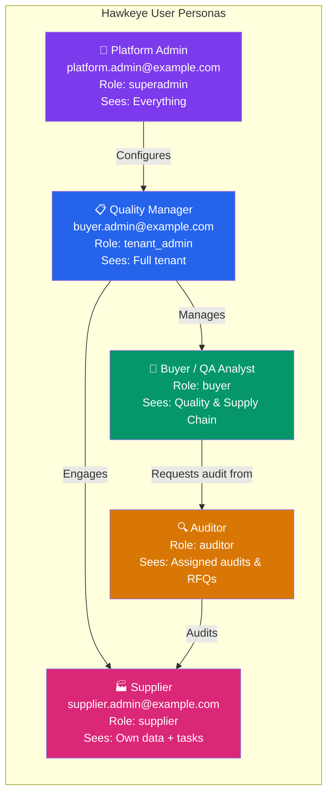

### Persona Comparison Table

| Capability | Platform Admin | Quality Manager | Buyer | Supplier | Auditor |
|---|:---:|:---:|:---:|:---:|:---:|
| Platform settings | ✅ | — | — | — | — |
| Tenant management | ✅ | — | — | — | — |
| Module config | ✅ | ✅ | — | — | — |
| EQMS (NCs, DCM, Risk) | ✅ | ✅ | ✅ | — | ✅ |
| Audit requests | ✅ | ✅ | ✅ | — | — |
| Audit execution | ✅ | ✅ | — | ✅ (answer) | ✅ (lead) |
| Supplier directory | ✅ | ✅ | ✅ | — | — |
| DigiLocker | ✅ | ✅ | ✅ | ✅ | ✅ |
| RFQs | ✅ | ✅ | ✅ | — | ✅ |
| Training records | ✅ | ✅ | ✅ | — | — |
| Insights / FDA | ✅ | ✅ | ✅ | ✅ | ✅ |

---

## 2. Getting Started — Login & Navigation

### Step 1: Sign In

1. Navigate to **`/auth/signin`**
2. Enter your email and password
3. Click **Sign In**

> **Test credentials (all roles use password `Testing@2022`):**
> - Platform Admin: `platform.admin@example.com`
> - Quality Manager: `buyer.admin@example.com`
> - Supplier: `supplier.admin@example.com`

### Step 2: Navigation — Top Bar (Mega Menu)

The top bar organises features into **7 sections**. Hover or click any section to open a dropdown panel.

```
┌─────────────────────────────────────────────────────────────────┐
│  🦅 Hawkeye  │ Quality │ Supply Chain │ Evidence │ Marketplace  │
│              │ Analytics │ EQMS │ Platform OS          [User ▼] │
└─────────────────────────────────────────────────────────────────┘
```

| Menu Section | What's Inside |
|---|---|
| **Quality** | Products, Compliance (CAPAs, Audits), Execution (Calendar, Templates) |
| **Supply Chain** | Suppliers, Engagements, Risk & Insights |
| **Evidence** | DigiLocker, Audit Trail, Workspace |
| **Marketplace** | Supplier Marketplace, Browse Products, Auditor Network |
| **Analytics** | Insights Dashboard, FDA Inspection, Reports |
| **EQMS** | Document Control, NCs, Complaints, Risk Register, Training, Management Review |
| **Platform OS** | Party Directory, CoC Tracker, Transactions, Module Config |

### Step 3: Navigation — Sidebar

The sidebar groups items by functional area. Expand each section:

- **DISCOVERY** — Insights, Supplier Risk, Product Catalog, FDA Dashboard
- **PROCUREMENT** — Request Audits, RFQs, Engagements, Qualification Cases
- **OPERATIONS** — Work Queue, Audit Summary, CAPAs, Calendar
- **ASSETS** — DigiLocker, Sites, API Library, Integrations
- **ADMIN** — Users, Notification Preferences, Settings
- **EQMS** — Document Control, NCs, Risk Register, Change Controls, Training, Management Review, Complaints
- **PLATFORM OS** — Parties, Events, CoC Tracker, Transactions, Pre-Qualification, Module Config

---

## 3. Persona: Platform Admin

**Email:** `platform.admin@example.com` | **Role:** `superadmin`

### What They Do

The Platform Admin manages the entire Hawkeye installation — creates tenants, monitors all activity, configures global settings, and has visibility across all organisations.

### Key Screens

| Screen | URL | Purpose |
|---|---|---|
| Platform Tenants | `/platform/tenants` | Create & manage tenant organisations |
| Platform Users | `/platform/users` | Global user directory |
| Audit Logs | `/platform/audit-logs` | All system events |
| Module Config | `/admin/module-config` | Enable/disable modules per tenant |
| RAG Vectors | `/admin/rag-vectors` | AI knowledge base management |
| AskHawk Admin | `/admin/askhawk` | AI assistant configuration |

### Workflow: Onboard a New Tenant

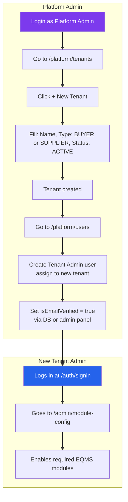

### Workflow: Configure Modules for a Tenant

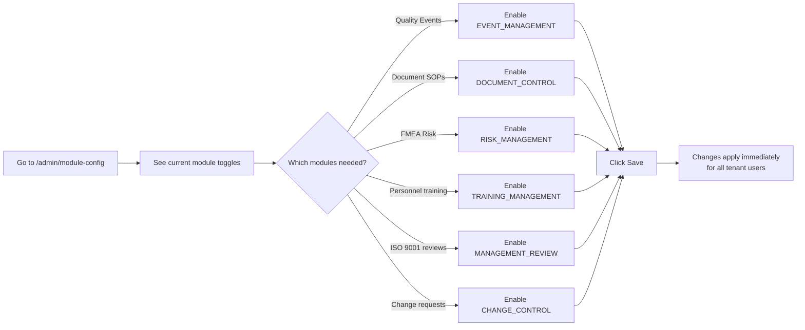

---

## 4. Persona: Quality Manager / Tenant Admin

**Email:** `buyer.admin@example.com` | **Role:** `tenant_admin`

### What They Do

The Quality Manager is the primary EQMS operator. They own the full quality lifecycle: scheduling audits, managing NCs and CAPAs, maintaining documents, overseeing training, and running management reviews.

### Dashboard Entry Points

```
/insights          → Quality KPI overview
/audits            → All audit activity
/document-control  → SOP / policy library
/nonconformance    → Open NCs
/risk-register     → FMEA risk table
/training          → Training completion rates
/management-review → ISO 9001 clause 9.3
/complaint-manager → Customer complaints
```

### Workflow: Full EQMS Quality Cycle

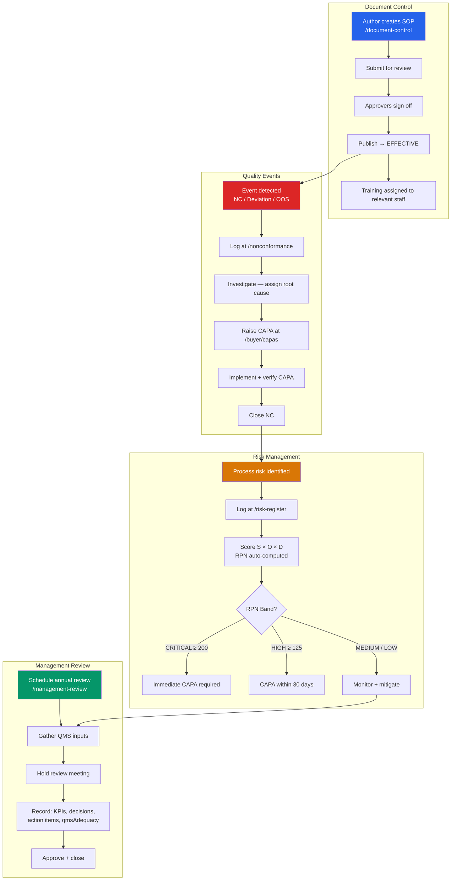

---

## 5. Persona: Buyer (QA Analyst)

**Role:** `buyer`

### What They Do

The Buyer/QA Analyst manages the supply base — qualifying suppliers, requesting audits, issuing RFQs, monitoring CAPAs, and reviewing supplier risk.

### Key Screens

| Screen | URL | Purpose |
|---|---|---|
| Supplier Directory | `/buyer/suppliers` | All approved suppliers + risk scores |
| Request Audit | `/request-audit` | Initiate a new GMP audit |
| Audit Summary | `/audits` | All audits in progress and completed |
| CAPAs | `/buyer/capas` | Corrective & preventive actions |
| RFQs | `/rfqs` | Request-for-qualification workflows |
| Qualification Cases | `/qualification-cases` | Structured qualification tracking |
| Pre-Qualification | `/supplier-prequalification` | Desk review before full audit |
| Audit Calendar | `/calendar` | Scheduled audits |

### Workflow: Request a GMP Audit (Buyer Swimlane)

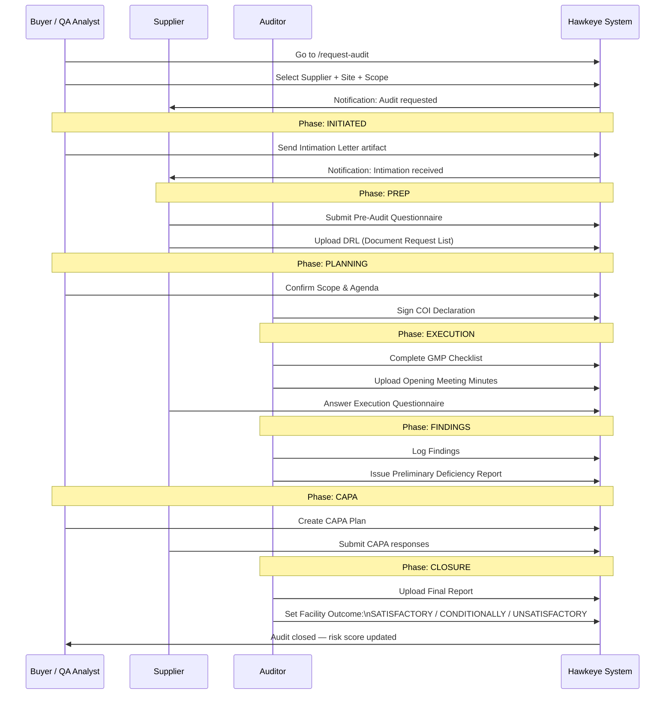

### Workflow: Supplier Risk Assessment

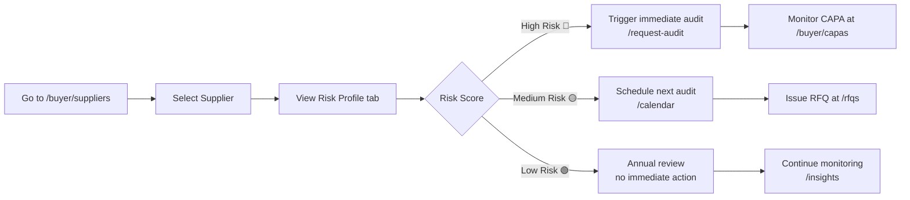

---

## 6. Persona: Supplier

**Email:** `supplier.admin@example.com` | **Role:** `supplier`

### What They Do

The Supplier responds to audit requests, submits questionnaires, uploads evidence documents to DigiLocker, and manages their product and site listings.

### Key Screens

| Screen | URL | Purpose |
|---|---|---|
| My Risk Profile | `/supplier/risk` | Own compliance score |
| DigiLocker | `/digilocker` | Upload & manage compliance documents |
| Work Queue | `/work/questionnaires` | Assigned questionnaires to complete |
| Products | `/products` | Product catalogue management |
| Sites | `/sites` | Manufacturing site profiles |
| Engagements | `/engagements` | Active buyer engagements |
| Notifications | `/workspace/notifications` | Alerts from buyers/auditors |

### Workflow: Respond to an Audit (Supplier Swimlane)

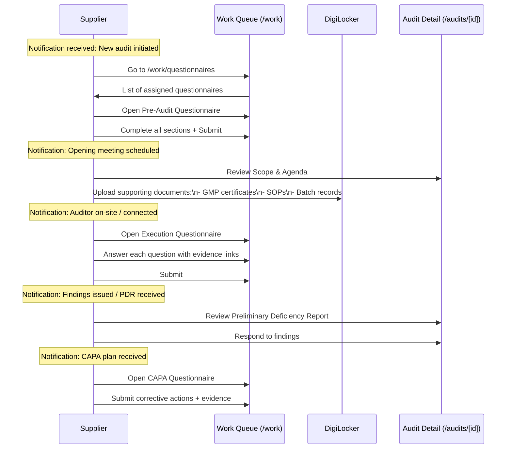

### Workflow: Upload Evidence to DigiLocker

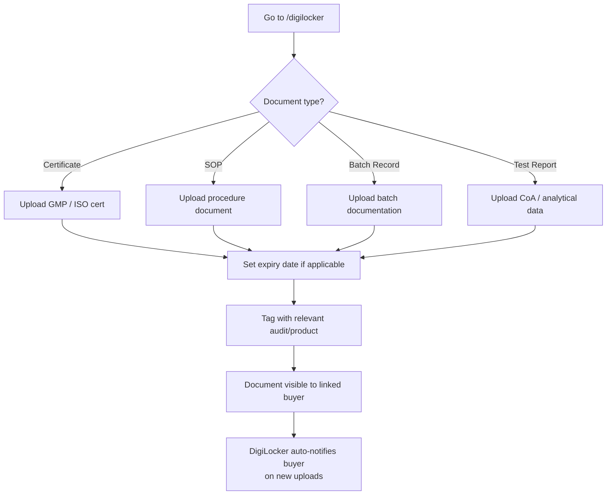

---

## 7. Persona: Auditor

**Role:** `auditor`

### What They Do

The Auditor leads on-site and remote GMP inspections. They complete checklists, log findings, sign COI declarations, issue the Preliminary Deficiency Report, and write the Final Report.

### Key Screens

| Screen | URL | Purpose |
|---|---|---|
| My Audits | `/auditor/audits` | Assigned audit list |
| Audit Execution | `/audits/[id]` | Active audit detail |
| Audit Calendar | `/calendar` | Upcoming scheduled audits |
| RFQs (Auditor) | `/auditor/rfqs` | Incoming qualification requests |
| CAPAs (Auditor) | `/auditor/capas` | CAPAs for my audits |
| Templates | `/template-management` | Questionnaire templates |
| Test Artifacts | `/test-artifacts` | Evidence from completed audits |
| Work Queue | `/work/questionnaires` | Assigned tasks |

### Workflow: Execute a GMP Audit (Auditor Swimlane)

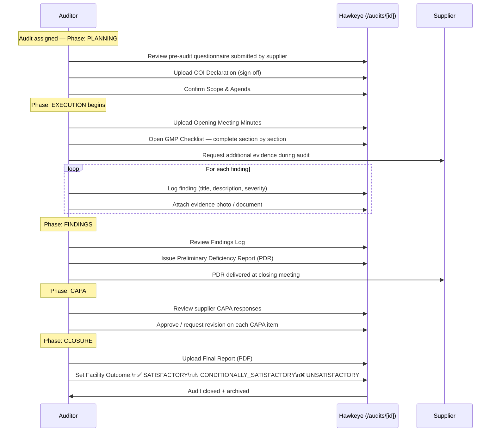

---

## 8. Core Workflow: End-to-End GMP Audit

This swimlane shows all actors across the full 8-phase audit lifecycle.

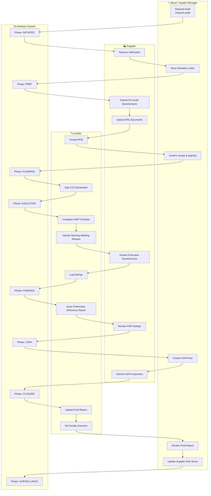

---

## 9. Core Workflow: EQMS — Nonconformance to CAPA Closure

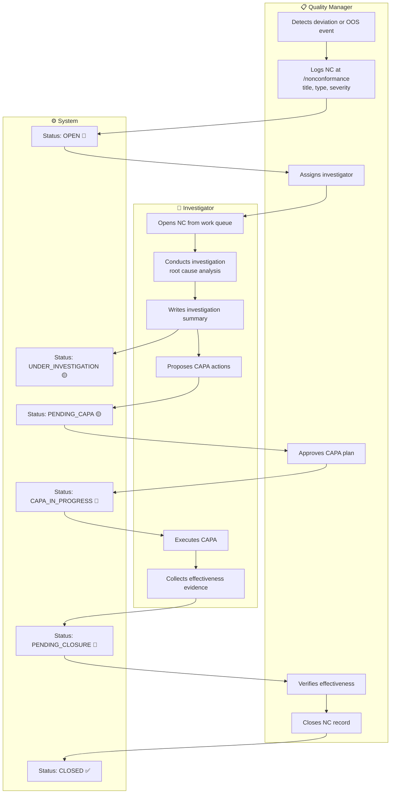

### Severity Classification

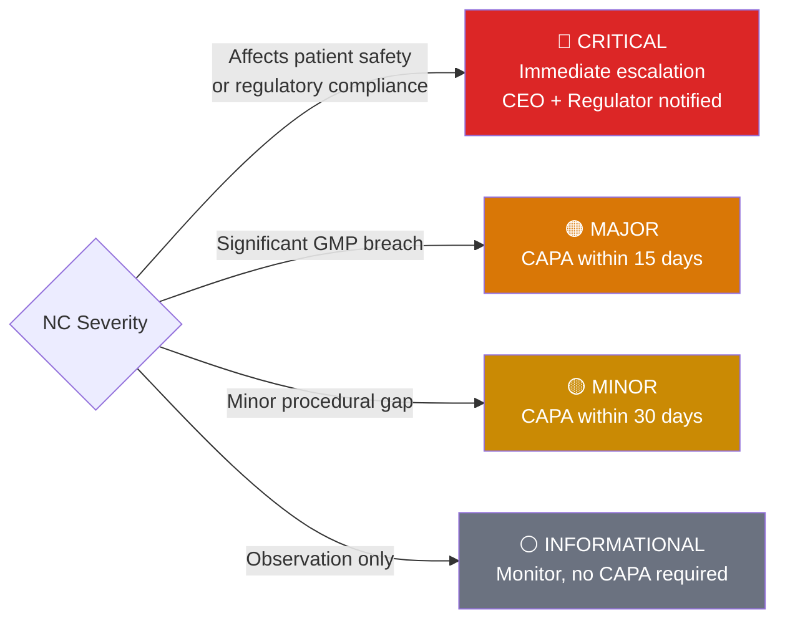

---

## 10. Core Workflow: Document Control Lifecycle

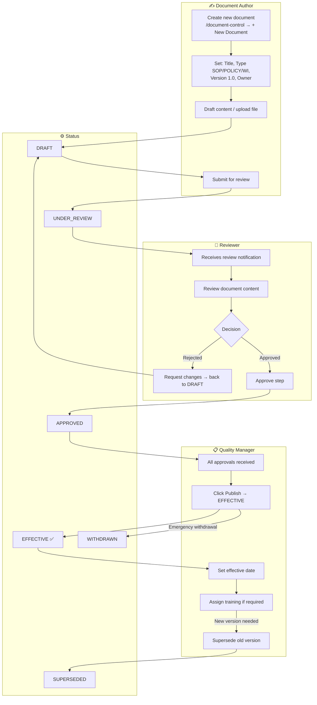

### Document Versioning

```
Major version bump  →  New document content (SOP revised)
Minor version bump  →  Minor corrections, formatting
DOC-2026-0001 v1.0  →  DOC-2026-0001 v1.1  →  DOC-2026-0001 v2.0
                                                     ↑
                                              supersedes v1.x
```

---

## 11. Core Workflow: Supplier Qualification Journey

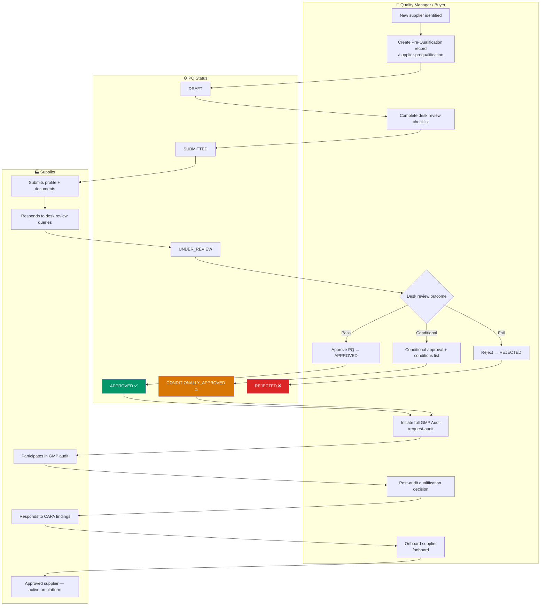

---

## 12. Core Workflow: Complaint Management

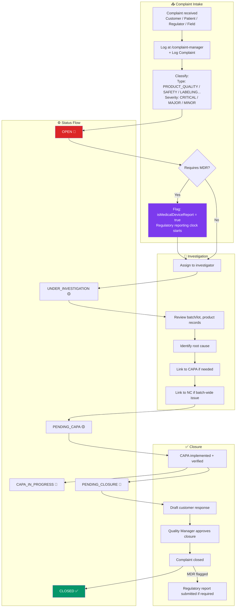

---

## 13. Core Workflow: Management Review Cycle

The Management Review fulfils **ISO 9001:2015 Clause 9.3** — top management reviews the QMS for suitability, adequacy, and effectiveness.

```mermaid
flowchart LR
    subgraph PLAN ["📅 Plan (1-4 weeks before)"]
        P1[Schedule review\n/management-review → + Schedule Review]
        P2[Set type: ANNUAL / QUARTERLY / AD_HOC]
        P3[Assign chair + attendees]
        P4[Define review period]
    end

    subgraph INPUT ["📊 Gather QMS Inputs"]
        IN1[Audit results summary]
        IN2[CAPA effectiveness data]
        IN3[Customer feedback + complaints]
        IN4[Process performance KPIs]
        IN5[NC trends]
        IN6[Previous action item status]
        IN7[Training completion rates]
        IN8[Risk register update]
    end

    subgraph MEETING ["🤝 Review Meeting"]
        M1[Status → IN_PROGRESS]
        M2[Present each QMS input]
        M3[Discuss performance gaps]
        M4[Record decisions]
        M5[Agree improvement opportunities]
        M6[Assign action items with owners + due dates]
    end

    subgraph OUTPUT ["📋 Outputs"]
        O1[Record qmsAdequacy:\nADEQUATE / NEEDS_IMPROVEMENT / INADEQUATE]
        O2[Resource decisions documented]
        O3[Action items tracked in system]
        O4[Status → COMPLETED ✅]
        O5[Upload meeting minutes document]
    end

    PLAN --> INPUT --> MEETING --> OUTPUT

    style O4 fill:#059669,color:#fff
```

### QMS Adequacy Outcomes

| Outcome | Meaning | Next Steps |
|---|---|---|
| ✅ **ADEQUATE** | QMS is functioning effectively | Continue current approach, minor improvements |
| ⚠️ **NEEDS IMPROVEMENT** | Gaps identified, action required | Action items assigned, tracked to closure |
| ❌ **INADEQUATE** | Systemic failures, urgent remediation | Immediate corrective program, potential regulatory notification |

---

## 14. Quick Reference — All URLs by Role

### Platform Admin

```
/platform/tenants          Manage tenant organisations
/platform/users            Global user directory
/platform/audit-logs       System audit trail
/admin/module-config       Enable/disable modules
/admin/rag-vectors         AI knowledge base
/admin/askhawk             AskHawk AI config
/insights                  Analytics overview
```

### Quality Manager / Tenant Admin

```
/admin/module-config       Enable EQMS modules first!
/audits                    All audits
/document-control          SOP / policy lifecycle
/nonconformance            NC tracker
/complaint-manager         Complaint tracker
/risk-register             FMEA risk table
/change-controls           Change control requests
/training                  Training assignments
/management-review         ISO 9001 §9.3 reviews
/supplier-prequalification Desk review records
/buyer/capas               CAPA management
/qualification-cases       Qualification tracking
/insights                  QMS performance KPIs
```

### Buyer / QA Analyst

```
/buyer/suppliers           Supplier directory + risk
/request-audit             Initiate new audit
/audits                    Audit pipeline
/buyer/capas               CAPAs
/rfqs                      RFQ management
/qualification-cases       Qualification cases
/calendar                  Audit calendar
/engagements               Supplier engagements
/digilocker                Evidence vault
/nonconformance            NCs (if module enabled)
```

### Supplier

```
/supplier/risk             Own compliance score
/work/questionnaires       Assigned questionnaires
/digilocker                Document uploads
/products                  Product listings
/sites                     Site profiles
/engagements               Active engagements
/workspace/notifications   Alerts & tasks
/supplier/api-library      API master catalog
```

### Auditor

```
/auditor/audits            Assigned audits
/audits/[id]               Execute active audit
/auditor/rfqs              Incoming RFQs
/auditor/capas             My CAPAs
/calendar                  Schedule
/template-management       Questionnaire templates
/test-artifacts            Audit evidence
/work/questionnaires       Task queue
```

---

## Tips & Troubleshooting

### Can't see EQMS menu items?
→ Modules are OFF by default. Go to `/admin/module-config` and enable them. You need `tenant_admin` or `superadmin` role.

### Getting "module not enabled" on an EQMS page?
→ The specific module for that page is disabled. Enable it at `/admin/module-config`.

### Empty list on any EQMS page?
→ No records exist yet. Use the `+` button on each page to create the first record.

### Login fails with "Invalid credentials"?
→ Check that the password stored in the DB is bcrypt-hashed (starts with `$2b$`). If stored as plain text, run the password migration script.

### Login fails with "Email not verified"?
→ Set `isEmailVerified: true` for the user in MongoDB directly, or use the admin user management panel.
