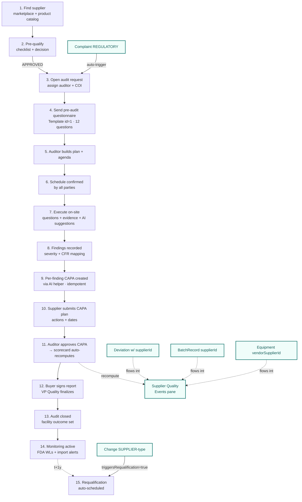

# Pharma Audit + Supplier + EQMS — Demo Script

> Audience: investors · sales-led demos · evaluation customer pilots.
> Runtime cuts: **30 min · 45 min · 60 min** (use-case selection in §5).
> Tenant: Acme Pharma (`acme-pharma-audit`) · password for all personas: `AuditDemo@2026`.
> Last updated: 2026-04-27.

---

## §1 — Why this demo (the elevator)

Pharma buyers manage **200-1,200 suppliers** but can audit **30-60 in person/year**. The rest get paper-screened, late. Findings → CAPA → closure runs in email + Excel. Hawkeye replaces that with **one workflow OS** where:

- Every quality event names its supplier (Tier 1 schema integration)
- Buyers see one supplier dashboard with all open EQMS work (Tier 2 UX)
- Audits, CAPAs, scorecards, and AI agents all share the same data (Tier 3 closure loops)
- Admin can govern + cost-recover AI usage (AI ROI dashboard)
- The whole thing is template-driven — change a vertical pack, you change the workflow

**The headline outcome we claim:** *Buyer covers 5x more suppliers with same headcount, and the AI ROI dashboard proves it at renewal time.*

---

## §2 — Process flow (graphical)



**The Tier 1+2+3 EQMS↔Supplier integration** is the green path on the right — every quality event the buyer logs becomes part of the supplier's profile automatically.

---

## §3 — Persona cast

| # | Persona | Role | Email | Side | Demo seat-time |
|---|---|---|---|---|---|
| 1 | **Karan Mehta** | Buyer · Purchase / SCM | `buyer.purchase@acme-pharma.demo` | buyer | UC-1 |
| 2 | **Priya Nair** | Buyer · Audit Program Mgr | `audit.program@acme-pharma.demo` | buyer | UC-3, 4, 6, 10, 12, 13 |
| 3 | **Dr Elena Vasquez** | Buyer · VP Quality (tenant_admin) | `vp.quality@acme-pharma.demo` | buyer | UC-10, 14 |
| 4 | **Maria Santos** | Auditor · Lead | `audit.lead@auditcorp.demo` | auditor | UC-2, 4-9 |
| 5 | **Rahul Kapoor** | Auditor · Co-Auditor | `auditor.co@auditcorp.demo` | auditor | UC-6 (pair-audit) |
| 6 | **Asha Sharma** | Supplier · QA Head | `qa.head@globalpharma.demo` | supplier | UC-2, 5, 9 |
| 7 | **Amit Kumar** | Supplier · Production | `production.mgr@globalpharma.demo` | supplier | UC-15 (batch records) |
| 8 | **Deepa Nair** | Supplier · QC Lab | `qc.lab@globalpharma.demo` | supplier | UC-11 (deviation) |
| 9 | **Raj Verma** | Supplier · Warehouse | `warehouse.mgr@globalpharma.demo` | supplier | UC-15 (batch dispatch) |
| 10 | **Meera Joshi** | Supplier · Regulatory | `regulatory@globalpharma.demo` | supplier | (background — change requester) |

**Login**: https://hawkeye-frontend-dev-chi.vercel.app/auth/signin · all passwords `AuditDemo@2026`.

---

## §4 — Use cases (15 total · ordered to flow on stage)

Each use case follows the same template:
- **Persona** · email + role
- **Menu path** · top-bar item → page (or direct URL)
- **Why** · the business outcome in 1 sentence
- **Talking points** · 3-5 bullets the demoer says aloud
- **Steps** · numbered click-by-click
- **AI/Hook** · which agent fires or which closure loop triggers
- **Expected** · what the audience sees on screen + in the data

### UC-1 · Onboard a new supplier
- **Persona**: Karan (Buyer Purchase)
- **Menu**: Procure → Pre-Qual (`/supplier-prequalification`)
- **Why**: Initiate the qualification process for a candidate supplier — the entry point for any new supplier engagement.
- **Talking points**:
  - "Karan is the procurement lead. He just got a sample request from R&D for Atorvastatin Calcium."
  - "Before we engage commercially, we open a pre-qualification — captures risk band, regulatory standards, product categories."
  - "Notice the auto-numbering: PQ-YYYY-NNNN. Same pattern every record gets in Hawkeye — auditable identifier."
- **Steps**:
  1. Login as Karan → land on dashboard
  2. Top-bar → **Pre-Qual**
  3. Click **+ Start Pre-Qual** (top-right)
  4. Fill `supplierName` = "Global Pharma — New Engagement"
  5. Pick `initialRiskBand` = MEDIUM
  6. Fill `regulatoryStandards` = ICH Q7, 21 CFR 211
  7. Click **Save** → row appears with `pqNumber=PQ-YYYY-NNNN`, status DRAFT
- **AI/Hook**: none (data-only step)
- **Expected**: Row in PQ register with auto-generated number, status DRAFT, owner=Karan

### UC-2 · Pre-qualify (technical checklist + decision)
- **Personas**: Asha (supplier fills) → Maria (auditor decides)
- **Menu**: Procure → Pre-Qual → click row
- **Why**: Capture the supplier's GMP posture without sending an auditor on-site yet. Cheap risk gate.
- **Talking points**:
  - "Asha at Global Pharma fills a 3-item checklist (GMP license, FDA inspection record, SMF currency)."
  - "Maria reviews + decides: APPROVED / CONDITIONAL / REJECTED. APPROVED PQ becomes the ticket to a real audit."
  - "Decision is e-signed and the validUntil is set (+2y). Auto-EXPIRE scheduler watches for the date."
- **Steps**:
  1. *(as Asha)* Submit the PQ → status flips DRAFT → SUBMITTED
  2. *(as Maria)* Open the PQ → click **Decision** → pick APPROVED → fill rationale → save
  3. PQ status flips to APPROVED · `validUntil` = +2y
- **AI/Hook**: none in core path (Supplier-Intel is UC-3)
- **Expected**: PQ status APPROVED, decision recorded, requiresFullAudit=true

### UC-3 · AI · Run public-data check on the supplier
- **Persona**: Priya (Audit Program Mgr)
- **Menu**: Discover → Suppliers → click Global Pharma → "Check public signals" button
- **Why**: Before scheduling an expensive on-site audit, automated public-data fusion catches red flags (FDA warning letters, import alerts, EMA EudraGMDP).
- **Talking points**:
  - "Hawkeye's Supplier-Intel agent fuses openFDA + FDA WL + EMA EudraGMDP + WHO PQ in 3-5 seconds."
  - "Returns a verdict: known_tenant / public_only / ambiguous / unknown."
  - "If the agent finds a fresh warning letter we didn't know about → audit scope expands BEFORE we schedule it. Saves a wasted trip."
- **Steps**:
  1. Login as Priya → **Suppliers** → search "Global Pharma" → open
  2. Click **"Check public signals"** (top-right of supplier page)
  3. Wait ~3-5s
  4. Drawer shows: openFDA registrations · WL hits · import alerts · verdict
- **AI/Hook**: `audit.supplier_intel` agent — POST `/api/ai/audit-agents/supplier-intel`
- **Expected**: Verdict drawer with public-data dossier; `agent-usage-events` row written

### UC-4 · Open audit request + COI sign + agenda
- **Personas**: Priya (creates) → Maria (signs COI + agenda)
- **Menu**: Procure → New Audit (`/request-audit`)
- **Why**: Spin up a real audit from the approved PQ. Auditor accepts, signs COI, builds agenda.
- **Talking points**:
  - "One click from PQ → audit request inherits supplier + product + site. No re-typing."
  - "Maria signs COI declaration — required by ISO 19011 §7.2. Stored on her AuditorQualification record."
  - "Agenda has typed blocks (opening / process walk / doc review / closing) with attendees per role."
- **Steps**:
  1. *(Priya)* Click **+ New Audit** → fill complianceDate → assign Maria as lead auditor → save
  2. *(Maria)* Receives notification → opens audit → **Sign COI** → Sign
  3. *(Maria)* **Build agenda** → 4 blocks (opening / process / docs / closing) → propose
  4. *(Priya + Asha)* **Confirm agenda** → status CONFIRMED
- **AI/Hook**: none
- **Expected**: AuditRequestMaster created · trackStatus="Awaiting Pre-Audit Questionnaire" · `coiDeclarations[]` has new entry

### UC-5 · Send + fill pre-audit questionnaire
- **Personas**: Priya (sends) → Asha (fills)
- **Menu**: Audit detail → PREP tab
- **Why**: Supplier completes the 12-question questionnaire (template id=1 — ICH Q7 / 21 CFR 211). Auditor uses responses to focus the on-site audit.
- **Talking points**:
  - "Template id=1 has 12 questions across 3 categories: GMP Quality Systems · Manufacturing & Process Controls · Documentation & Records."
  - "Each question carries CFR references, evidence-upload affordance, response-schema for validation."
  - "Optional: AI pre-fill button populates answers from Asha's existing supplier KB. She reviews + edits + submits."
- **Steps**:
  1. *(Priya)* Audit detail → **Send Questionnaire** → status flips to SENT
  2. *(Asha)* Login → Audit detail → click **Open Questionnaire**
  3. Optional: click **AI pre-fill** → fills draft answers
  4. Asha reviews + edits + clicks **Submit**
  5. PreAuditQuestionnaire flips DRAFT → SENT → IN_PROGRESS → SUBMITTED
- **AI/Hook**: `audit.preaudit.prefill` (legacy helper) — instrumented in our wrapper too
- **Expected**: 12 responses persisted; questionnaireStatus = supplier_submitted

### UC-6 · Execute on-site audit
- **Personas**: Maria (lead) + Rahul (co-auditor)
- **Menu**: Audits → click row → Execution tab
- **Why**: The actual on-site or remote audit. Auditors respond to questions, attach evidence, can flag follow-ups.
- **Talking points**:
  - "Maria works the checklist (~80-150 questions). For each she records observation + attaches evidence (PDF/photo)."
  - "AI Observation Drafter button beside each question — suggests wording from cross-tenant anonymized findings. Maria edits + accepts."
  - "Closing meeting attendees sign in. CLOSING_MEETING_MINUTES artifact captured."
- **Steps**:
  1. *(Maria)* Audit → **Execution** tab → status flips IN_PROGRESS
  2. For 5-10 questions: response + evidence upload
  3. On a tricky question: click **AI Suggest** → drafter returns wording → accept
  4. **Closing meeting** → upload minutes → mark milestone CLOSING_MEETING=DONE
- **AI/Hook**: `audit.draft_observation` (Wave-2 cross-tenant)
- **Expected**: AuditQuestions[] populated, Evidence[] attached, trackStatus="Audit Completed"

### UC-7 · Findings + AI report assembly
- **Persona**: Maria
- **Menu**: Audit detail → Findings tab + Report tab
- **Why**: Convert observations → formal findings (severity + GMP class + CFR ref) → AI-assembled draft report.
- **Talking points**:
  - "3 findings recorded: 1 CRITICAL (calibration), 1 MAJOR (change control SOP), 1 MINOR (training refresh)."
  - "AI Report Assembler reads findings + evidence + ICH Q7 context → draft narrative report. Maria reviews + edits."
  - "Report has 8 blocks: cover · meta · scope · findings table · observations · CAPA summary · outcome · sign-off. Defined in ReportTemplate."
- **Steps**:
  1. *(Maria)* **Findings** tab → record 3 findings with severity + CFR refs
  2. **Report** tab → click **AI Assemble Report**
  3. AI populates 8 blocks (~30 sec)
  4. Maria reviews + saves DRAFT
- **AI/Hook**: `audit.report.assemble` agent
- **Expected**: AssessmentFinding[] = 3 rows · AuditReport.observations[] = 3 entries · AuditReport.status = DRAFT

### UC-8 · Per-finding CAPA auto-create (Tier 3c)
- **Persona**: Maria
- **Menu**: Audit detail → Report tab → click finding → "Create CAPA" button
- **Why**: Each finding spawns a CAPA. Idempotent — clicking twice doesn't duplicate.
- **Talking points**:
  - "POST `/api/audits/:auditId/report/observations/:observationId/capa` — sibling to the bulk handler."
  - "Severity → target date mapping: CRITICAL=15d, MAJOR=30d, MINOR=60d. Auto-set."
  - "Reused on second click — returns the existing CAPA, not a duplicate. We tested this 4 times in Tier-3c smoke (16/16 PASS)."
- **Steps**:
  1. *(Maria)* Open the CRITICAL finding → click **Create CAPA**
  2. New CAPA card appears: status NEEDS_SUPPLIER, target +15d
  3. Click again → "reused" toast (no duplicate)
- **AI/Hook**: not AI — server-side helper
- **Expected**: Capa row created · linkedObservationIds includes the finding · status NEEDS_SUPPLIER

### UC-9 · Supplier files CAPA plan
- **Persona**: Asha
- **Menu**: Audits → CAPAs → click row → fill plan
- **Why**: Supplier responds to the auditor's CAPA with corrective + preventive actions and target dates.
- **Talking points**:
  - "Asha reads the finding, drafts root cause + corrective action."
  - "Optional: AI RCA Drafter button generates a 5-Whys / fishbone scaffold. She edits to match her real investigation."
  - "Submits → status flips IN_REVIEW. The auditor (Maria) reviews next."
- **Steps**:
  1. *(Asha)* **CAPAs** menu → open the CRITICAL one
  2. Click **AI Draft RCA** → fills 5-Whys
  3. Asha edits the RCA + adds 2 actions with target dates
  4. Submit → status IN_REVIEW
- **AI/Hook**: `capa.draft_rca`
- **Expected**: Capa.status = IN_REVIEW · Capa.actions[] = 2 entries

### UC-10 · Audit closure + scorecard refresh (Tier 2 hook)
- **Personas**: Maria (approves CAPA) → Priya (signs report) → Elena (final approval)
- **Menu**: CAPA → Approve · Audit → Close
- **Why**: Approving a supplier-linked CAPA fires the Tier-2 closure-loop hook — recomputes the supplier scorecard + writes a SupplierRiskSnapshot.
- **Talking points**:
  - "Maria approves Asha's CAPA → server hook fires `calculateSupplierScorecard` → new SupplierRiskSnapshot persisted in seconds."
  - "Priya checks `/buyer/suppliers/<asha-id>/quality-events` and the Risk Score tab — the band updated."
  - "Elena signs as VP Quality with REVIEWED meaning · facilityOutcome = CONDITIONALLY_SATISFACTORY · audit closed."
- **Steps**:
  1. *(Maria)* PATCH CAPA status to APPROVED
  2. *(Priya)* Open `/buyer/suppliers/<asha-id>/risk` → see new snapshot row
  3. *(Priya)* Audit → Close → set facility outcome
  4. *(Elena)* Sign report (REVIEWED) → status flips COMPLETED
- **AI/Hook**: Tier-2 closure hook in `capaController.updateCapaStatus`
- **Expected**: SupplierRiskSnapshot inserted · audit.trackStatus="Audit Closed" · audit.facilityOutcome set

### UC-11 · Filing a deviation tied to supplier (Tier 1 supplierId)
- **Persona**: Deepa (Supplier QC Lab)
- **Menu**: EQMS → Deviations
- **Why**: Show that even a supplier-side deviation (lab OOS) carries supplierId, gets surfaced in Priya's unified view immediately.
- **Talking points**:
  - "Deepa runs a dissolution test, finds an OOS result on a real lot."
  - "She files a deviation. **The supplier field is auto-populated** — that's the Tier-1 schema integration we built."
  - "Priya, on the buyer side, sees this deviation appear in her supplier Quality Events pane within seconds."
- **Steps**:
  1. *(Deepa)* **Deviations** menu → **+ New Deviation**
  2. Fill title, description, classification=MAJOR, lot number, supplierLot
  3. supplierId pre-populated to her own org · sourceFromSupplier auto-set true
  4. Save
- **AI/Hook**: optional `deviation.five_why` for RCA scaffold (gets supplier history injected per Tier 1)
- **Expected**: Deviation has supplierId · sourceFromSupplier=true · appears in Priya's Quality Events

### UC-12 · Regulatory complaint → for-cause audit (Tier 2 closure loop)
- **Persona**: Priya
- **Menu**: EQMS → Complaints
- **Why**: Demonstrate the **automatic** workflow handoff — file a regulatory complaint, watch a for-cause audit auto-spawn against the supplier.
- **Talking points**:
  - "Priya files a CRITICAL safety complaint linking back to Asha's supplier."
  - "Pre-save hook detects: severity=CRITICAL + complaintType=SAFETY → auto-flags `requiresRegulatoryReporting=true`, sets MDR clock to 5/15/30 days per 21 CFR 803."
  - "Then post-save hook fires `triggerForCauseAudit` → new AuditRequestMaster created with auditType=FOR_CAUSE. Idempotent — duplicate complaints don't spawn duplicate audits."
  - "Complaint.linkedAuditId is back-filled. Buyer can pivot from complaint → audit in one click."
- **Steps**:
  1. *(Priya)* **Complaints** → **+ New Complaint**
  2. Severity=CRITICAL, type=SAFETY, supplierId=Asha
  3. Save
  4. Refresh → see `linkedAuditId` populated
  5. Open Suppliers → Asha → **Quality Events** tab → Audits subtab → new FOR_CAUSE row
- **AI/Hook**: `complaint.triage` agent (gets supplier history injected) + `triggerForCauseAudit` server hook
- **Expected**: Complaint.requiresRegulatoryReporting=true · linkedAuditId set · FOR_CAUSE audit visible

### UC-13 · Unified supplier Quality Events pane (Tier 2 UX)
- **Persona**: Priya
- **Menu**: Discover → Suppliers → click Global Pharma → **Quality Events** tab
- **Why**: Deliver the headline buyer outcome — one screen showing every open EQMS event for one supplier.
- **Talking points**:
  - "Tier 2 deliverable. Backend aggregator joins 7 collections (CAPAs · deviations · complaints · changes · audits · batches · equipment) and returns counts + lists."
  - "Top: SupplierContextBadge with risk band + per-module open counts."
  - "8 KPI tiles + 7 tabs. Recently-closed switch shows last 90 days."
  - "This is what replaces the buyer's Excel spreadsheet of open work."
- **Steps**:
  1. *(Priya)* **Suppliers** → Global Pharma
  2. Click **Quality Events** tab
  3. Toggle **Show recently-closed** switch
  4. Click each tab to show inventory: CAPAs, Deviations, Complaints, Changes, Audits (incl. FOR_CAUSE highlighted), Batches, Equipment
- **AI/Hook**: none (data aggregation + render)
- **Expected**: 8 KPI tiles populated · 7 tabs with rows · all 4 events from earlier UCs visible (CAPA, deviation, complaint, FOR_CAUSE audit)

### UC-14 · Admin · AI ROI dashboard + permission matrix
- **Persona**: Elena (VP Quality, tenant_admin)
- **Menu**: Admin → Admin Panel → AI Agents tab
- **Why**: Show the buyer-facing AI ROI story (the renewal-conversation winner) + governance.
- **Talking points**:
  - "Headline: hours saved · labor saved · LLM cost · ROI multiple. ~150x at typical usage."
  - "Per-agent breakdown — which agents actually deliver value, which need prompt tuning."
  - "Permissions matrix: Elena toggles which roles can call which agents and sets quotas. Policy stored in `agent-permissions` collection."
  - "Tenant quota dial: monthly token cap + cost cap. Enforcement: hard / soft / unlimited."
- **Steps**:
  1. *(Elena)* **Admin Panel** → **AI Agents & Permissions** in left sub-nav
  2. Tab 1 **ROI Dashboard** — show gradient hero card with KPIs + per-agent table
  3. Tab 2 **Recent Calls** — last 200 agent invocations with outcome
  4. Tab 3 **Permissions Editor** — pick role, see agent-by-agent toggles + quotas, change one, **Save**
  5. Tab 4 **Tenant Quota** — dial caps + enforcement mode
- **AI/Hook**: read-only — exercises the AI governance layer (Phase 0 of admin panel work)
- **Expected**: ROI dashboard with non-zero numbers · permissions UI persists changes (PUT /api/admin/ai/permissions)

### UC-15 · BatchRecord traceability (Tier 3 supplier↔lot)
- **Persona**: Amit (Production Mgr) → Raj (Warehouse) — referenced; Priya pulls the view
- **Menu**: EQMS → Batches → click row · OR Suppliers → Global Pharma → Quality Events → Batches tab
- **Why**: Demonstrate end-to-end lot traceability: BatchRecord carries `primarySupplierId` AND per-BOM-line `supplierId`. Recall workflows can walk this graph.
- **Talking points**:
  - "Two ways a batch links to a supplier: top-level (relabel/repackage) OR per-BOM-line (multi-source raw materials)."
  - "Aggregator query uses `$or` — picks up both. The Batches tab on the Quality Events pane shows everything in one list."
  - "If Asha's API is recalled, we walk BatchRecord.billOfMaterials → linkedDeviationIds to find affected lots in 1 query."
- **Steps**:
  1. Open the Batches tab on Asha's Quality Events page
  2. Show 1 batch with primarySupplierId · 1 with BOM-only link
  3. Open one batch — show BOM with supplier per line item
- **AI/Hook**: none (data trace)
- **Expected**: 2+ rows in Batches tab; both link to Asha

---

## §5 — Demo rails

### 30-min cut (8 use cases · investor / first sales call)
| min | UC | What |
|---|---|---|
| 0-3 | §1 elevator + §2 process flow | Frame |
| 3-7 | UC-1 + UC-2 | Onboard + Pre-qualify |
| 7-10 | UC-3 | AI Supplier-Intel (the "wow") |
| 10-15 | UC-4 + UC-5 | Audit + questionnaire |
| 15-18 | UC-7 | AI Report Assembler (the second "wow") |
| 18-22 | UC-12 | Regulatory complaint → for-cause audit (closure loop) |
| 22-26 | UC-13 | Quality Events unified pane (the buyer's "I want this") |
| 26-30 | UC-14 | AI ROI dashboard (the CFO renewal winner) |

### 45-min cut (12 use cases · sales evaluation)
Add: UC-6 (execution), UC-8 (per-obs CAPA), UC-9 (supplier CAPA plan), UC-10 (closure loop)

### 60-min cut (15 use cases · pilot kickoff)
All UCs above + UC-11 (deviation), UC-15 (batch traceability).

### Q&A handling
| Question | Answer |
|---|---|
| "Are these AI agents calling real LLMs?" | Yes — Gemini Flash-Lite + Claude Sonnet via `groundedGenerate`. Calls audit-trailed in `agent-usage-events`. |
| "Can we run this on-prem?" | Yes — see Doc 3 in `06-go-to-market/`. Llama 70B reference architecture with Helm chart. 5/6 agent parity vs cloud. |
| "What about data residency?" | EU region available on Atlas. Hybrid model (data-stays-in-VPC, agents-orchestrated-in-cloud) ships with PII redaction proxy. |
| "How is this different from Qualifyze?" | Qualifyze is pharma-only marketplace, no engine. Hawkeye is vertical-pack engine + marketplace + AI agents — multi-vertical, configurable, embedded EQMS. |
| "Who are the competitors?" | Cluster 1 BigPharma EQMS (MasterControl, Veeva, TrackWise — internal-tool). Cluster 2 Salesforce-native (Dot Compliance, ComplianceQuest). Cluster 3 marketplace (Qualifyze, Rx-360). We sit at the intersection. |

### Gotchas
- **Cold-start lag**: First action after idle takes 5-15s (Vercel lambda + Mongo connection warm-up). Cover with talk: "watching the lambda spin up" or hit `/api/admin/ai/catalog` 30s before the demo to warm.
- **AI agents may return 403 if permissions matrix is locked**: Pre-flight — login as Elena, ensure all 12 agents are toggled on for `buyer` and `auditor` roles.
- **For-cause audit dedupe**: If UC-12 has been demo'd before in same session, the second trigger returns `existing` rather than creating new. Either delete the prior FOR_CAUSE audit OR talk through the dedupe explicitly ("idempotency in action").

---

## §6 — Appendix

### A. URLs
- Frontend: https://hawkeye-frontend-dev-chi.vercel.app/auth/signin
- Backend: https://hawkeye-backend-dev.vercel.app

### B. Login table

| Persona | Email | Password |
|---|---|---|
| Karan | `buyer.purchase@acme-pharma.demo` | `AuditDemo@2026` |
| Priya | `audit.program@acme-pharma.demo` | `AuditDemo@2026` |
| Elena | `vp.quality@acme-pharma.demo` | `AuditDemo@2026` |
| Maria | `audit.lead@auditcorp.demo` | `AuditDemo@2026` |
| Rahul | `auditor.co@auditcorp.demo` | `AuditDemo@2026` |
| Asha | `qa.head@globalpharma.demo` | `AuditDemo@2026` |
| Amit | `production.mgr@globalpharma.demo` | `AuditDemo@2026` |
| Deepa | `qc.lab@globalpharma.demo` | `AuditDemo@2026` |
| Raj | `warehouse.mgr@globalpharma.demo` | `AuditDemo@2026` |
| Meera | `regulatory@globalpharma.demo` | `AuditDemo@2026` |

### C. Pre-flight verification
Before going on stage:
```bash
# Backend warm + data sanity
curl -X POST https://hawkeye-backend-dev.vercel.app/api/auth/login \
  -H "Content-Type: application/json" \
  -d '{"email":"audit.program@acme-pharma.demo","password":"AuditDemo@2026"}'

# Should return token + role=buyer + adminScope=NONE + tenantId=...

# Verify aggregator returns data
TOKEN=<paste from above>
curl -H "Authorization: Bearer $TOKEN" \
  "https://hawkeye-backend-dev.vercel.app/api/suppliers/<asha-id>/quality-events?includeClosed=true"

# Should return counts.total > 0
```

### D. Re-seed if needed
If the demo data is degraded:
```bash
cd backend
node scripts/seed-audit-only-users.mjs
```
Idempotent — only creates missing rows.

### E. Tier 1+2+3 + admin governance scope
Refer to `docs/06-go-to-market/01-vision-positioning.md` for the full architectural backdrop.
