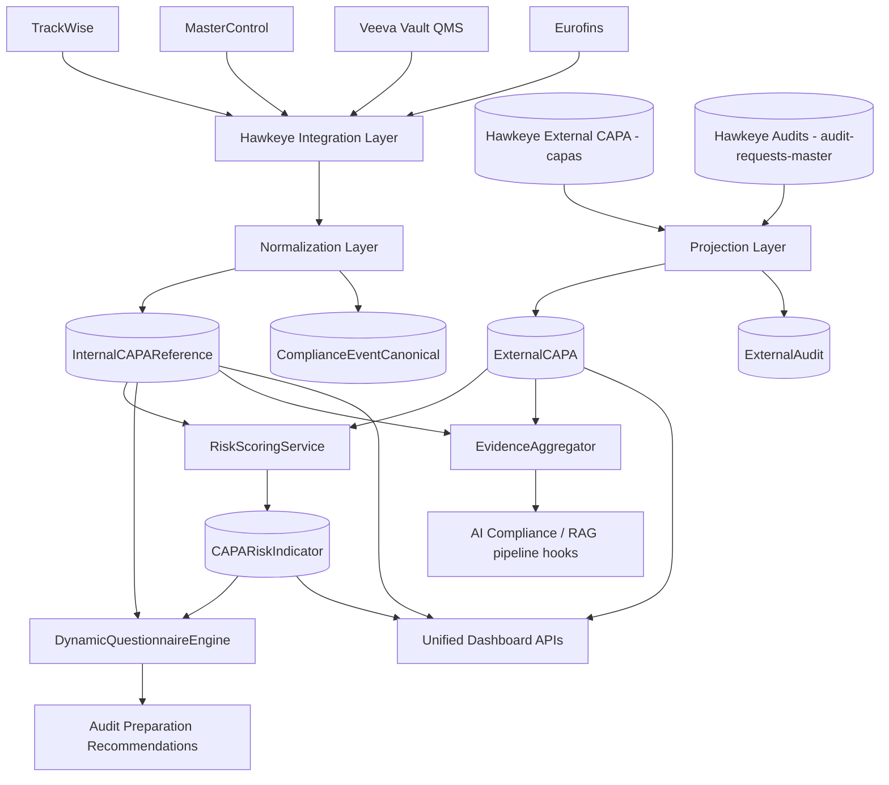
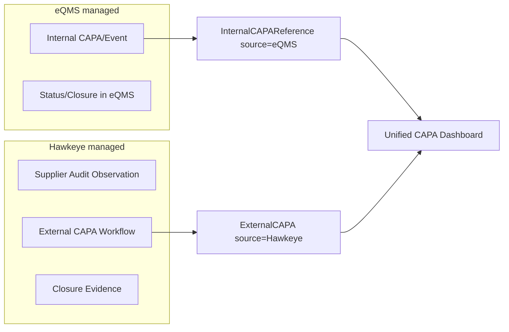

# Hawkeye eQMS Intelligence Architecture (Dev)

## 1) Platform Positioning
- Hawkeye is an **audit intelligence overlay**.
- Internal CAPA/deviation/change workflows remain in enterprise eQMS (TrackWise, MasterControl, Veeva, Eurofins).
- Hawkeye ingests internal quality signals and combines them with Hawkeye external audit/CAPA data for risk and audit preparation.

## 2) System Context

## 3) Internal vs External CAPA Separation

## 4) Additive Implementation Scope
- New models only:
  - `InternalCAPAReference`
  - `ExternalCAPA`
  - `ExternalAudit`
  - `CAPARiskIndicator`
- New connectors only:
  - TrackWise, MasterControl, Veeva, Eurofins under `src/integrations/eqms/*`
- New APIs only:
  - mounted at `/api/eqms-intel/*`

No existing audit/questionnaire/auth/risk endpoints were replaced.
