# Hawkeye Platform — Technical Architecture

> Version: Phase 1 EQMS  |  Last updated: 2026-03-27

---

## Table of Contents

1. [System Overview](#1-system-overview)
2. [Technology Stack](#2-technology-stack)
3. [System Topology](#3-system-topology)
4. [Frontend Architecture](#4-frontend-architecture)
5. [Backend Architecture](#5-backend-architecture)
6. [Database Layer](#6-database-layer)
7. [Authentication & Security](#7-authentication--security)
8. [Universal Platform OS](#8-universal-platform-os)
9. [EQMS Module Architecture](#9-eqms-module-architecture)
10. [Audit Lifecycle Engine](#10-audit-lifecycle-engine)
11. [API Design Conventions](#11-api-design-conventions)
12. [Deployment Architecture](#12-deployment-architecture)
13. [Module Feature Flags](#13-module-feature-flags)

---

## 1. System Overview

Hawkeye is a cloud-native, multi-tenant B2B platform for **pharma supply-chain quality management**. It connects Buyers (pharma manufacturers), Suppliers (API/excipient makers), and Auditors in a unified compliance workflow.

### Core Capabilities

| Domain | Capability |
|---|---|
| **Supplier Quality** | Qualification, onboarding, risk scoring, RFQs |
| **Audit Management** | End-to-end GxP/GMP audit lifecycle (8 phases) |
| **EQMS** | Document Control, NC, CAPA, Risk Register, Training, Complaints, Management Review |
| **Evidence** | DigiLocker vault, artifact tracking, RAG-powered audit reports |
| **Intelligence** | FDA inspection data, AI-powered compliance analytics, AskHawk |
| **Platform OS** | Universal workflow engine — Party, Event, Subject, ChangeControl, CoC |

---

## 2. Technology Stack

```
┌─────────────────────────────────────────────────────────────┐
│                        FRONTEND                              │
│  Next.js 15 (App Router)  ·  TypeScript  ·  MUI v6         │
│  next-intl (i18n)  ·  Phosphor Icons  ·  Axios             │
└─────────────────────────────────────────────────────────────┘
                              │ HTTPS / REST
┌─────────────────────────────────────────────────────────────┐
│                        BACKEND                               │
│  Node.js (ESM)  ·  Express 5  ·  JWT (jsonwebtoken)        │
│  bcryptjs  ·  Mongoose 8  ·  Joi validation                 │
│  OpenAI / Gemini  ·  AWS S3  ·  Mailgun                    │
└─────────────────────────────────────────────────────────────┘
                              │ MongoDB Wire Protocol
┌─────────────────────────────────────────────────────────────┐
│                       DATA LAYER                             │
│  MongoDB Atlas (hawkeye-dev cluster)                        │
│  Database: hawkeye  ·  Multi-tenant via tenantId field      │
└─────────────────────────────────────────────────────────────┘
```

---

## 3. System Topology

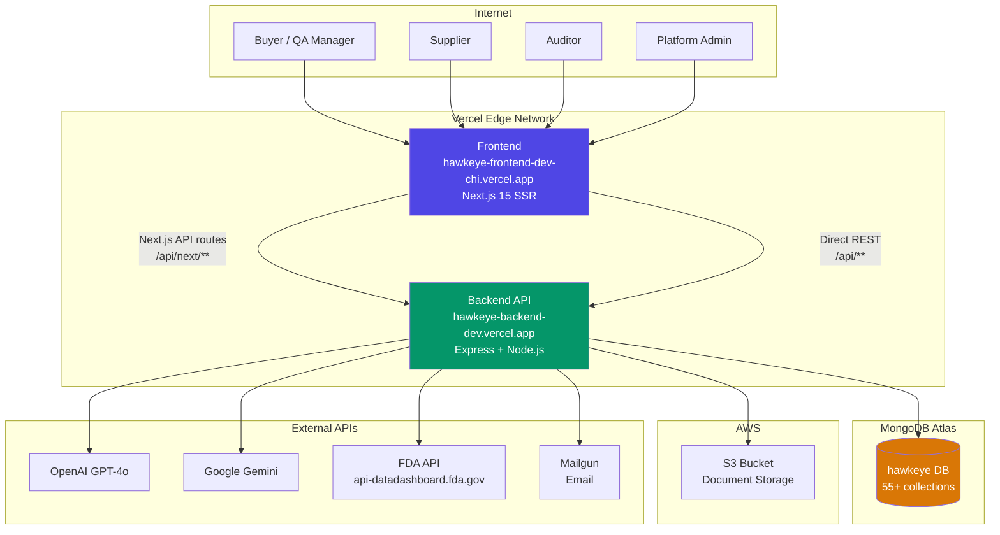

---

## 4. Frontend Architecture

### App Router Structure

```
app/
├── (console)/           ← Authenticated app shell
│   ├── layout.tsx       ← ConsoleShell + SessionProvider + UniversalPlatformProvider
│   ├── audits/          ← Audit management
│   ├── document-control/← EQMS: Document Control
│   ├── nonconformance/  ← EQMS: NC Manager
│   ├── risk-register/   ← EQMS: FMEA Risk Register
│   ├── training/        ← EQMS: Training & Competency
│   ├── management-review/← EQMS: Management Review
│   ├── complaint-manager/← EQMS: Complaints
│   ├── change-controls/ ← Universal Platform OS
│   ├── events/          ← Universal Platform OS
│   ├── parties/         ← Universal Platform OS
│   └── admin/
│       └── module-config/ ← Tenant module toggles
├── auth/                ← Unauthenticated
│   └── signin/
└── api/
    └── next/            ← Next.js API proxy routes → Backend
```

### Context Providers

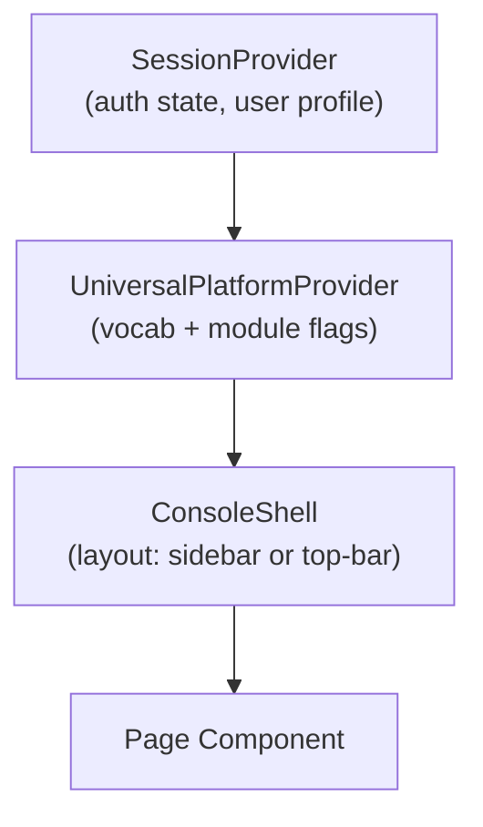

### UniversalPlatformContext

Every page inside `(console)/` has access to:

```typescript
const { vocab, modules, loading, refresh } = useUniversalPlatform();
// vocab.audit  → "Audit" | "Inspection" | "Review"  (per tenant)
// modules.DOCUMENT_CONTROL → true | false
// modules.EVENT_MANAGEMENT → true | false
```

Module gates work like:
```typescript
if (!modules.RISK_MANAGEMENT) return <Alert>Module not enabled</Alert>;
```

### Navigation Architecture

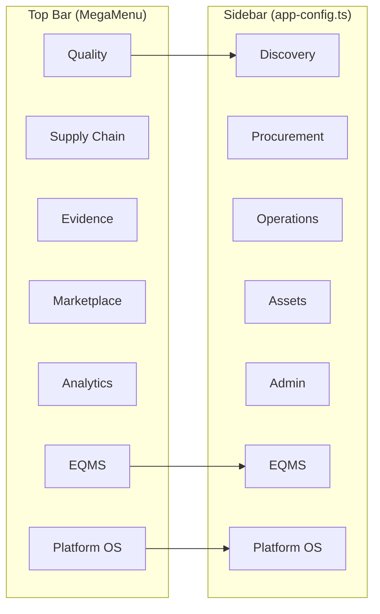

---

## 5. Backend Architecture

### Request Lifecycle

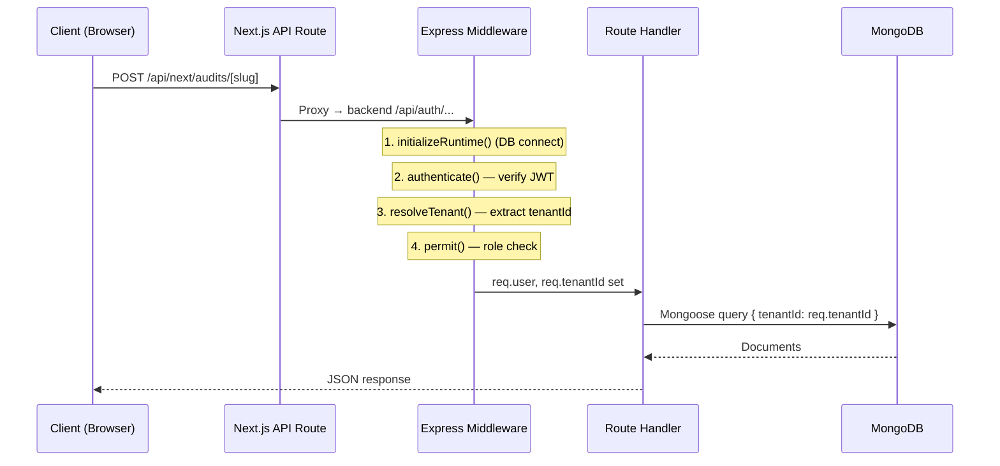

### Route Namespace Map

| Namespace | Purpose |
|---|---|
| `/api/auth/*` | Login, register, reset password, verify email |
| `/api/buyer/*` | Buyer-specific: suppliers, risk, CAPAs |
| `/api/auditor/*` | Auditor RFQs, compliance runs |
| `/api/audit-requests/*` | Audit request CRUD |
| `/api/universal/module-config` | Tenant module config (EQMS gates) |
| `/api/universal/parties` | Party directory |
| `/api/universal/events` | Workflow events (NCs, incidents) |
| `/api/universal/change-controls` | Change control records |
| `/api/document-control` | DCM — SOP/policy lifecycle |
| `/api/risk-items` | FMEA risk register |
| `/api/training-records` | Training assignments |
| `/api/management-reviews` | ISO 9001 §9.3 reviews |
| `/api/complaints` | Complaint Manager |
| `/api/supplier-prequalifications` | PQ desk review |
| `/api/rfqs/*` | RFQ procurement |
| `/api/capas/*` | CAPA management |
| `/api/digilocker/*` | Document vault |
| `/api/v2/*` | V2 product library, org catalog |

### Middleware Stack

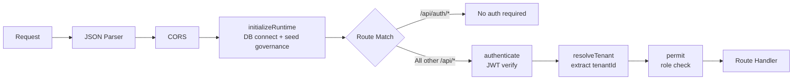

---

## 6. Database Layer

### Multi-Tenancy Pattern

Every document that belongs to a tenant has `tenantId` (string) as a required, indexed field. All queries include `{ tenantId: req.tenantId }` automatically.

```javascript
// Pattern used in every EQMS route handler
const items = await Model.find({ tenantId: req.tenantId, ...filters });
```

### Key Collections

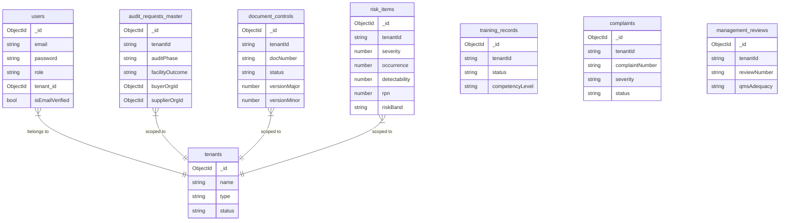

### Auto-Generated ID Sequences

| Model | Format | Example |
|---|---|---|
| Document Control | `DOC-YYYY-NNNN` | `DOC-2026-0001` |
| Management Review | `MR-YYYY-NNNN` | `MR-2026-0001` |
| Change Control | `CCR-YYYY-NNNN` | `CCR-2026-0001` |
| Supplier Pre-Qual | `PQ-YYYY-NNNN` | `PQ-2026-0001` |
| Complaint | `CMP-YYYY-NNNN` | `CMP-2026-0001` |

Generated via Mongoose pre-save hooks with `findOne().sort({ id: -1 })` to get the last sequence number.

### FMEA RPN Computation (Auto, pre-save hook)

```
RPN = Severity (1–10) × Occurrence (1–10) × Detectability (1–10)

Risk Band:
  RPN ≥ 200  → CRITICAL  🔴
  RPN ≥ 125  → HIGH      🟠
  RPN ≥  60  → MEDIUM    🟡
  RPN <  60  → LOW       🟢
```

---

## 7. Authentication & Security

### Login Flow

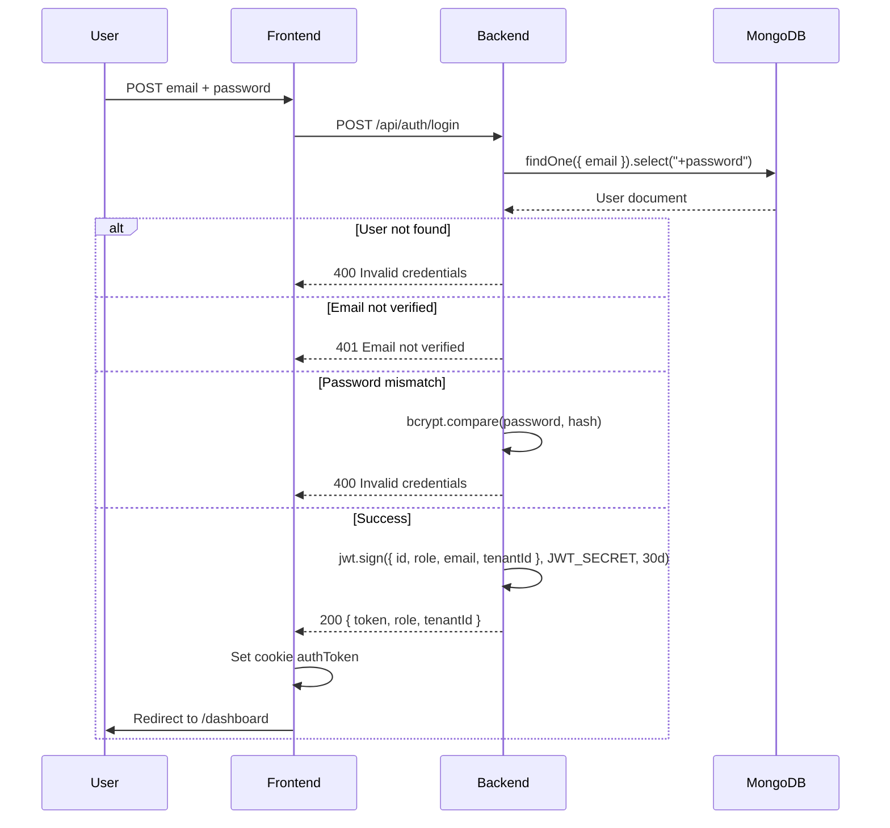

### JWT Token Structure

```json
{
  "id": "<ObjectId>",
  "role": "buyer | supplier | auditor | tenant_admin | superadmin",
  "email": "user@example.com",
  "tenantId": "<ObjectId>",
  "iat": 1234567890,
  "exp": 1234567890
}
```

### Role Hierarchy

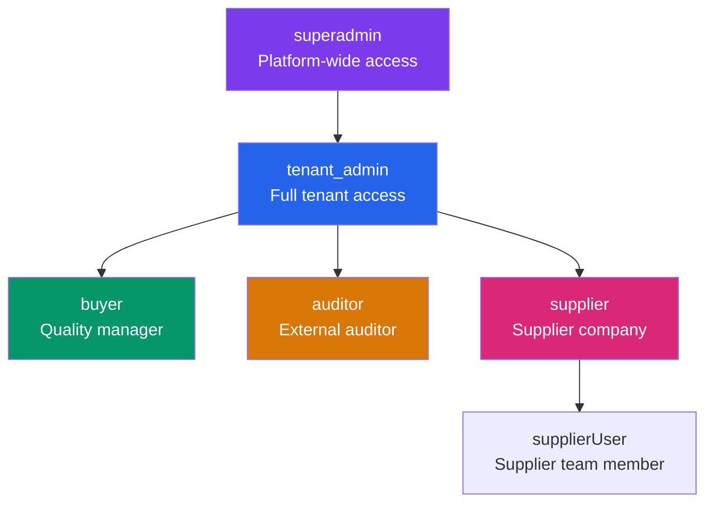

---

## 8. Universal Platform OS

The Platform OS provides **5 primitives** that can model any compliance domain:

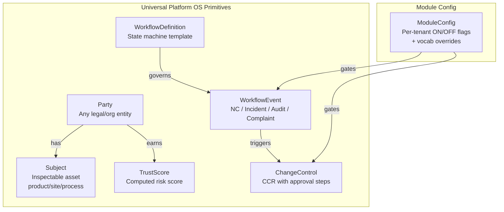

### Vocabulary Override System

Tenants can rename any domain concept:

| Key | Pharma default | Alternative (e.g. Food) |
|---|---|---|
| `audit` | Audit | Inspection |
| `supplier` | Supplier | Farm / Vendor |
| `buyer` | Buyer | Retailer |
| `finding` | Finding | Observation |
| `capa` | CAPA | Corrective Action |
| `site` | Site | Facility |

---

## 9. EQMS Module Architecture

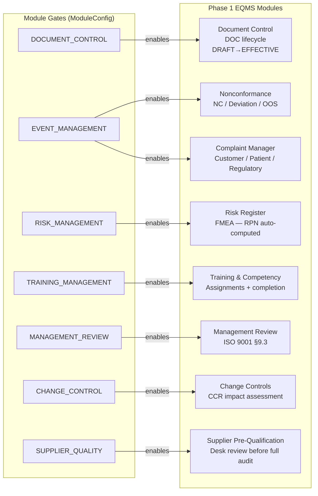

### Document Control Lifecycle

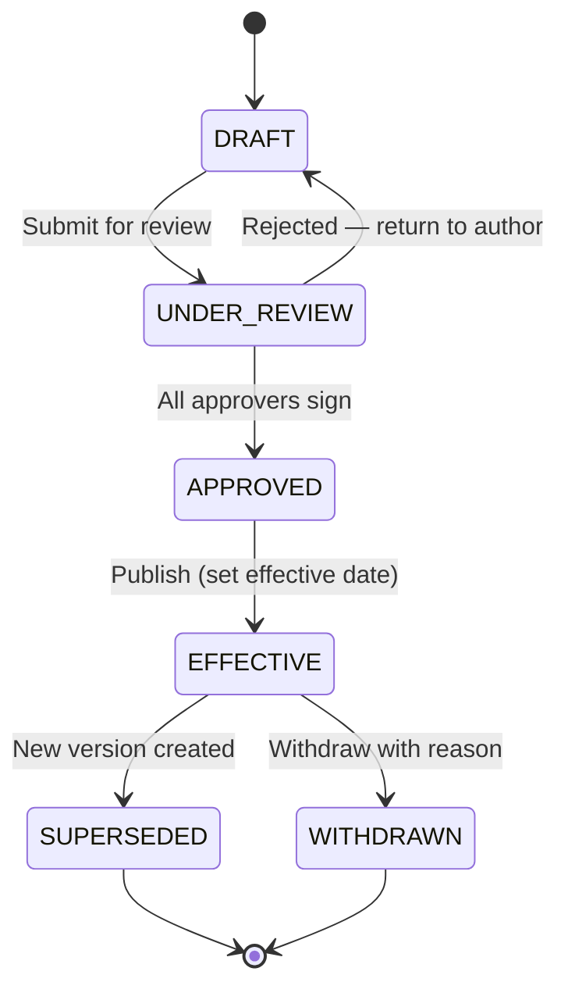

### NC / Complaint / Event Lifecycle

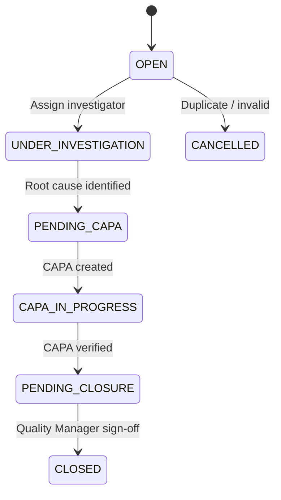

---

## 10. Audit Lifecycle Engine

### 8-Phase GMP Audit

```mermaid
stateDiagram-v2
    direction LR
    [*] --> INITIATED : Audit requested
    INITIATED --> PREP : Intimation letter sent
    PREP --> PLANNING : Pre-audit questionnaire received
    PLANNING --> EXECUTION : Scope & agenda confirmed\n+ COI declaration signed
    EXECUTION --> FINDINGS : GMP checklist complete\n+ Opening meeting minutes
    FINDINGS --> CAPA : PDR issued at closing meeting
    CAPA --> CLOSURE : CAPA plan accepted
    CLOSURE --> SURVEILLANCE : Final report issued
    SURVEILLANCE --> [*]
```

### Facility Outcome (Phase 0 GxP)

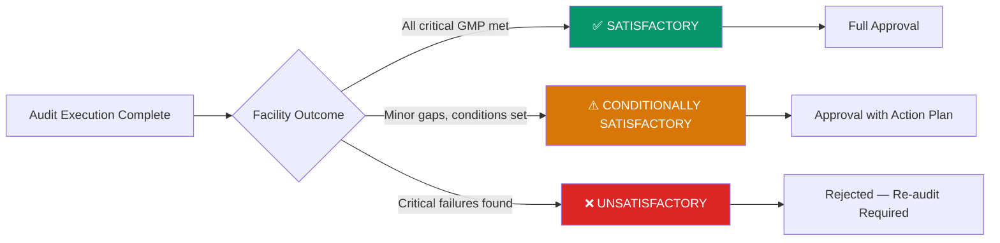

### Audit Artifacts per Phase

| Phase | Required Artifacts |
|---|---|
| INITIATED | Intimation Letter, RFQ |
| PREP | Pre-Audit Questionnaire, DRL |
| PLANNING | Scope, Agenda, **COI Declaration** |
| EXECUTION | Execution Questionnaire, GMP Checklist, **Opening Meeting Minutes** |
| FINDINGS | Findings Log, **Preliminary Deficiency Report** |
| CAPA | CAPA Plan |
| CLOSURE | Final Report |

---

## 11. API Design Conventions

### URL Patterns

```
GET    /api/{resource}              → List (with query filters)
GET    /api/{resource}/:id          → Single record
POST   /api/{resource}              → Create
PUT    /api/{resource}/:id          → Full update
DELETE /api/{resource}/:id          → Delete (guarded by status)

POST   /api/{resource}/:id/approve  → State transition: approve
POST   /api/{resource}/:id/close    → State transition: close
POST   /api/{resource}/:id/publish  → State transition: publish
```

### Standard Error Responses

```json
{ "error": "Description of what went wrong" }
```

HTTP status codes:
- `400` — Validation error / business rule violation
- `401` — Not authenticated
- `403` — Not authorized (wrong role)
- `404` — Not found
- `409` — Conflict (e.g. deleting non-DRAFT document)
- `500` — Internal server error

### Tenant Isolation

Every response is filtered by `tenantId`. Cross-tenant data access is architecturally impossible — the tenant is extracted from the verified JWT and injected into every query.

---

## 12. Deployment Architecture

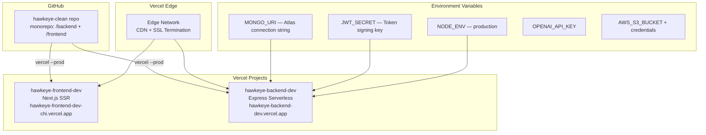

### Environment Setup Checklist

| Variable | Where | Notes |
|---|---|---|
| `MONGO_URI` | Backend Vercel | Atlas connection string, `hawkeye` db |
| `JWT_SECRET` | Backend Vercel | `hawkeye-jwt-secret-nov-20-2024` |
| `NODE_ENV` | Backend Vercel | Must be exactly `production` (no trailing newline) |
| `NEXT_PUBLIC_API_BASE_URL` | Frontend Vercel | Points to backend URL |
| `OPENAI_API_KEY` | Backend Vercel | GPT-4o for audit RAG + AskHawk |
| `AWS_S3_BUCKET` | Backend Vercel | `hawkeye-backend-storage` |

---

## 13. Module Feature Flags

Modules are toggled **per-tenant** via the `ModuleConfig` collection. The frontend reads the active config on every session via `GET /api/universal/module-config/active`.

### Available Modules

| Key | Default | Controls |
|---|---|---|
| `AUDIT_MANAGEMENT` | ✅ ON | All audit pages |
| `DOCUMENT_CONTROL` | ✅ ON | `/document-control` |
| `CAPA_MANAGEMENT` | ✅ ON | `/buyer/capas` |
| `SUPPLIER_QUALITY` | ✅ ON | `/supplier-prequalification` |
| `REGULATORY_INTEL` | ✅ ON | `/fda-dashboard`, `/insights` |
| `AI_ASSISTANT` | ✅ ON | AskHawk, AI prefill |
| `RFQ_PROCUREMENT` | ✅ ON | `/rfqs` |
| `CHANGE_CONTROL` | ❌ OFF | `/change-controls` |
| `EVENT_MANAGEMENT` | ❌ OFF | `/nonconformance`, `/events`, `/complaint-manager` |
| `TRAINING_MANAGEMENT` | ❌ OFF | `/training` |
| `RISK_MANAGEMENT` | ❌ OFF | `/risk-register` |
| `MANAGEMENT_REVIEW` | ❌ OFF | `/management-review` |
| `ASSET_MANAGEMENT` | ❌ OFF | Future |
| `CHAIN_OF_CUSTODY` | ❌ OFF | `/coc-tracker` |
| `TRANSACTION_REVIEW` | ❌ OFF | `/transactions` |

> **To enable modules:** Log in as tenant admin → navigate to `/admin/module-config` → toggle ON → click Save.
